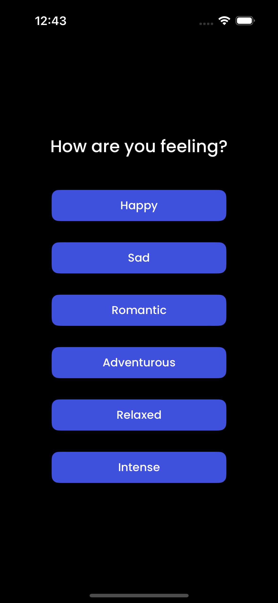
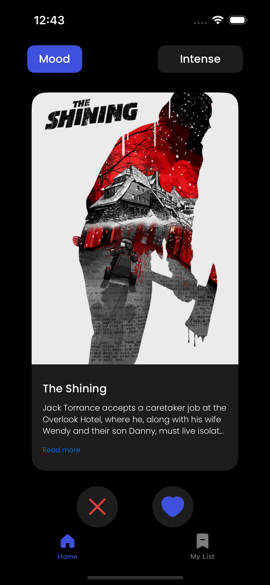
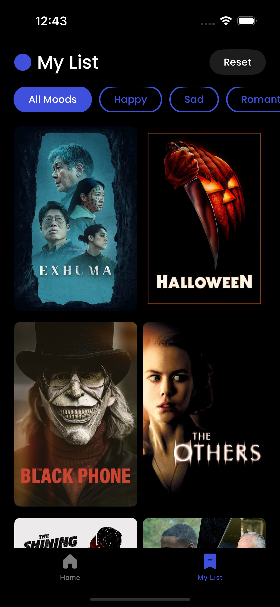
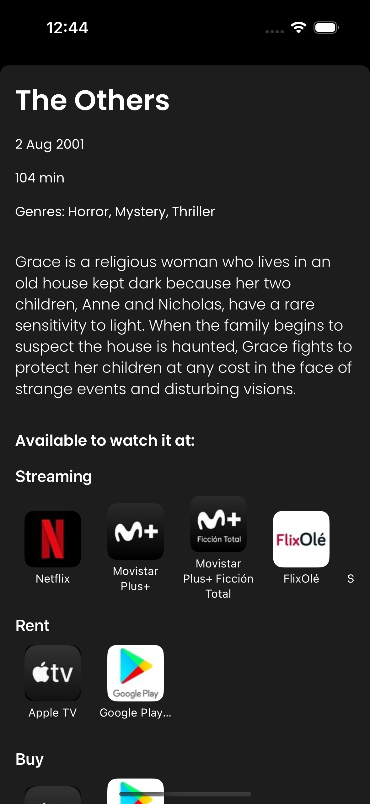

# Moodi

Moodi is an iOS application built in Swift that helps users discover movies based on their current mood. Unlike traditional movie recommendation apps, Moodi takes a fun, swipe-based approach—making it easy to find and save films that match how you feel right now.

## Features

- **Mood-Based Recommendations:** Pick your mood and instantly get a curated set of movies tailored for how you feel.
- **Swipe to Save:** Swipe through movie cards—add favorites to your personal list with a simple swipe.
- **Movie Details:** Tap any movie to see its synopsis, cast, and more.
- **Where to Watch:** Instantly see which streaming platforms offer each movie, powered by the TMDB API.
- **No Login Required:** Jump right in and start discovering—no account needed (yet)!

## How It Works

1. **Select Your Mood:** Start by choosing how you feel from a list of moods (happy, sad, excited, etc.).
2. **Swipe Through Movies:** Get a stack of movies mapped to your selected mood. Swipe right to save, left to skip.
3. **View Your List:** Access your saved movies anytime from your personal list.
4. **Check Details & Streaming Providers:** For each movie, see detailed info and where it's currently available to stream.

## Screenshots


<p align="center">
  
  
  
  
  
</p>


## Installation

1. Clone the repository:
   ```bash
   git clone https://github.com/mariaadev/Moodi.git
   ```
2. Open the project in [Xcode](https://developer.apple.com/xcode/).
3. Build and run the app in the simulator or on your iOS device.

## Requirements

- iOS 13.0+
- Xcode 14.0+
- Swift 5+
- TMDB API Key (see below)

## TMDB API Setup

To fetch movies and provider info, you’ll need a [TMDB](https://www.themoviedb.org/documentation/api) API key.

1. Sign up at [TMDB](https://www.themoviedb.org/documentation/api) to obtain an API key.
2. Add your API key to the project as instructed in the code (typically as an environment variable or in a config file).

